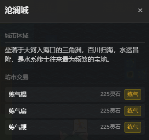
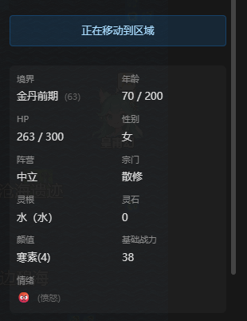
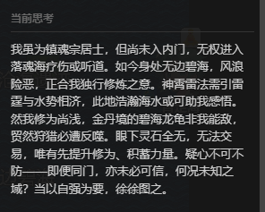
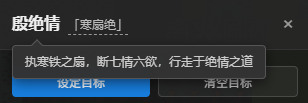
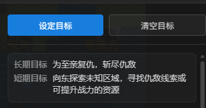
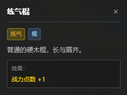

<!-- 語言 / Language -->
<h3 align="center">
  <a href="../../README.md">简体中文</a> · <a href="ZH-TW_README.md">繁體中文</a> · <a href="EN_README.md">English</a>
</h3>
<p align="center">— ✦ —</p>

# 修仙世界模擬器 (Cultivation World Simulator)


[](https://store.steampowered.com/app/4443180)
[](https://space.bilibili.com/527346837)

[](https://discord.gg/shhRWmZR)
[](../../LICENSE)


<p align="center">
  
</p>

> **一個 AI 驅動的修仙世界模擬器，旨在創造一個真正活著的、有沉浸感的仙俠世界。**

<p align="center">
  <a href="https://hellogithub.com/repository/4thfever/cultivation-world-simulator" target="_blank">
    
  </a>
</p>

## 📖 簡介

這是一個 **AI 驅動的開放世界修仙模擬器**。

不同於傳統的 RPG 扮演某個角色，在這裡，**你將扮演「天道」（上帝）**。
你不需要親自打怪升級，而是以上帝視角觀察眾生，在規則與 AI 共同編織的開放世界中，見證門派興衰與天驕崛起。你可以靜觀滄海桑田，也可以降下天劫或魔改心靈，微妙地干預世界進程。

### ✨ 核心亮點

- 👁️ **扮演「天道」 (上帝視角)**：你不是修士，而是掌控世界規則的**天道**。觀察眾生百態，體味苦辣酸甜。
- 🤖 **全員 AI 驅動**：每個 NPC 都獨立基於 LLM 驅動，都有獨立的性格、記憶、人際關係和行為邏輯。他們會根據即時局勢做出決策，會有愛恨情仇，會結黨營私，甚至會逆天改命。
- 🌏 **規則作為基石**：世界基於靈根、境界、功法、壽元等嚴謹的數值體系運行。AI 的想像力被限制在合理的修仙邏輯框架內，確保世界真實可信。
- 🦋 **湧現式劇情**：開發者也不知道下一秒會發生什麼。沒有預設劇本，只有無數因果交織出的世界演變。宗門大戰、正魔之爭、天驕隕落，皆由世界邏輯自主推演。

<table border="0">
  <tr>
    <td width="33%" valign="top">
      <h4 align="center">宗門體系</h4>
      
      <br/><br/>
      <h4 align="center">城市區域</h4>
      
      <br/><br/>
      <h4 align="center">生平經歷</h4>
      
    </td>
    <td width="33%" valign="top">
      <h4 align="center">角色面板</h4>
      
      <br/><br/>
      <h4 align="center">性格特質</h4>
      
      <br/><br/>
      <h4 align="center">自主思考</h4>
      
      <br/><br/>
      <h4 align="center">江湖綽號</h4>
      
    </td>
    <td width="33%" valign="top">
      <h4 align="center">洞府探秘</h4>
      
      <br/><br/>
      <h4 align="center">長短期目標</h4>
      
      <br/><br/>
      <h4 align="center">丹藥/法寶/武器</h4>
      
      
      
    </td>
  </tr>
</table>

### 💭 為什麼要做這個？
修仙網文中的世界很精彩，但讀者永遠只能觀察到一隅。

修仙品類遊戲要麼是完全的預設劇本，要麼依靠人工設計的簡單規則狀態機，有許許多多牽強和降智的表現。

在大語言模型出現後，讓「每一個角色都是鮮活的」的目標變得似乎可以觸達了。

希望能創造出純粹的、快樂的、直接的、活著的修仙世界的沉浸感。不是像一些遊戲公司的純粹宣傳工具，也不是像史丹福小鎮那樣的純粹研究，而是能給玩家提供真實代入感和沉浸感的實際世界。

## 📞 聯絡方式
如果您對項目有任何問題或建議，歡迎提交 Issue。

- **Steam**: [商店頁面](https://store.steampowered.com/app/4443180)
- **Bilibili**: [點擊關注](https://space.bilibili.com/527346837)
- **QQ群**: `1071821688` (入群答案：肥桥今天吃什么)
- **Discord**: [加入社區](https://discord.gg/shhRWmZR)

## 🚀 快速開始

### 方式一：Docker 一鍵部署（推薦）

無需配置環境，直接運行即可：

```bash
git clone https://github.com/AI-Cultivation/cultivation-world-simulator.git
cd cultivation-world-simulator
docker-compose up -d --build
```

訪問地址：前端 `http://localhost:8123` | 後端 `http://localhost:8002`

### 方式二：源碼部署（開發模式）

適合需要修改程式碼或調試的開發者。

1. **環境準備與啟動**
   ```bash
   # 1. 安裝後端依賴
   pip install -r requirements.txt

   # 2. 安裝前端依賴 (需 Node.js)
   cd web && npm install && cd ..

   # 3. 啟動服務 (自動拉起前後端)
   python src/server/main.py --dev
   ```

2. **模型配置**
   服務啟動後，瀏覽器會自動打開。**推薦直接在前端設置頁面選擇預設（如 DeepSeek/Ollama）**，也可手動修改 `static/local_config.yml`。

---

### 📱 高級功能

<details>
<summary><b>區域網/手機訪問配置 (點擊展開)</b></summary>

> ⚠️ 移動端 UI 暫未完全適配，僅供嚐鮮。

1. **後端配置**：修改 `static/local_config.yml`，添加 `host: "0.0.0.0"`。
2. **前端配置**：修改 `web/vite.config.ts`，在 server 塊中添加 `host: '0.0.0.0'`。
3. **訪問方式**：確保手機與電腦在同一 WiFi 下，訪問 `http://<電腦區域網IP>:5173`。

</details>


## 📊 項目狀態


## ⭐ Star History

如果你覺得這個項目有趣，請給我們一個 Star ⭐！這將激勵我們持續改進和添加新功能。

<div align="center">
  <a href="https://star-history.com/#4thfever/cultivation-world-simulator&Date">
    
  </a>
</div>

## 👥 貢獻者

<a href="https://github.com/4thfever/cultivation-world-simulator/graphs/contributors">
  
</a>

更多貢獻細節請查看 [CONTRIBUTORS.md](../../CONTRIBUTORS.md)。

## 📋 功能開發進度

### 🏗️ 基礎系統
- ✅ 基礎世界地圖、時間、事件系統
- ✅ 多樣化地形類型（平原、山脈、森林、沙漠、水域等）
- ✅ 基於Web前端顯示界面
- ✅ 基礎模擬器框架
- ✅ 配置文件
- ✅ release 一鍵即玩的exe
- ✅ 菜單欄 & 存檔 & 讀檔
- ✅ 靈活自定義 LLM 接口
- ✅ 支援 macOS
- ✅ 多語言本地化
- ✅ 開始遊戲頁
- ✅ BGM & 音效

### 🗺️ 世界系統
- ✅ 基礎 tile 地塊系統
- ✅ 基礎區域、修行區域、城市區域、宗門區域
- ✅ 同地塊 NPC 交互
- ✅ 靈氣分佈與產出設計
- ✅ 世界事件
- ✅ 天地人榜

### 👤 角色系統
- ✅ 角色基礎屬性系統
- ✅ 修煉境界體系
- ✅ 靈根系統
- ✅ 基礎移動動作
- ✅ 角色特質與性格
- ✅ 境界突破機制
- ✅ 角色間的相互關係
- ✅ 角色交互範圍
- ✅ 角色 Effects 系統：增益/減益效果
- ✅ 角色功法
- ✅ 角色兵器 & 輔助裝備
- ✅ 丹藥
- ✅ 角色長短期記憶
- ✅ 角色的長短期目標，支援玩家主動設定
- ✅ 角色綽號
- [ ] 生活技能
  - ✅ 鑄造
  - ✅ 煉丹
  - [ ] 種植
  - [ ] 飼養
  - [ ] 技能可升級
- ✅ 凡人
- [ ] 化神境界

### 🏛️ 組織
- ✅ 宗門
  - ✅ 設定、功法、療傷、駐地、行事風格
  - ✅ 宗門特殊動作：合歡宗（雙修），百獸宗（御獸）等
  - ✅ 宗門等階
  - ✅ 道統
- [ ] 世家
- [ ] 朝廷
- [ ] 組織意志 AI
- [ ] 組織任務、資源、機能
- [ ] 組織間關係網絡

### ⚡ 動作系統
- ✅ 基礎移動動作
- ✅ 動作執行框架
- ✅ 有明確規則的定義動作
- ✅ 長動作執行和結算系統
  - ✅ 支援多月份持續的動作（如修煉、突破、遊戲等）
  - ✅ 動作完成時的自動結算機制
- ✅ 多人動作：動作發起與動作響應
- ✅ 影響人際關係的 LLM 動作
- ✅ 系統性的動作註冊與運行邏輯

### 🎭 事件系統
- ✅ 天地靈氣變動
- ✅ 多人大事件：
  - ✅ 拍賣會
  - ✅ 秘境探索
  - ✅ 天下武道會
  - ✅ 宗門傳道大會
- [ ] 突發事件
  - [ ] 寶物/洞府出世
  - [ ] 天災

### ⚔️ 戰鬥系統
- ✅ 優劣互克關係
- ✅ 勝率計算系統

### 🎒 物品系統
- ✅ 基礎物品、靈石框架
- ✅ 物品交易機制

### 🌿 生態系統
- ✅ 動植物
- ✅ 狩獵、採集、材料系統
- [ ] 魔獸

### 🤖 AI 增強系統
- ✅ LLM 接口集成
- ✅ 角色 AI 系統（規則 AI + LLM AI）
- ✅ 協程化決策機制，異步運行，多線程加速 AI 決策
- ✅ 長期規劃和目標導向行為
- ✅ 突發動作響應系統（對外界刺激的即時反應）
- ✅ LLM 驅動的 NPC 對話、思考、互動
- ✅ LLM 生成小片段劇情
- ✅ 根據任務需求分別接入 max/flash 模型
- ✅ 小劇場
  - ✅ 戰鬥小劇場
  - ✅ 對話小劇場
  - ✅ 小劇場不同文字風格
- ✅ 一次性選擇（如是否要切換功法）

### 🏛️ 世界背景系統
- ✅ 注入基礎世界知識
- ✅ 用戶輸入歷史，動態生成功法、裝備、宗門、區域資訊

### ✨ 特殊
- ✅ 奇遇
- ✅ 天劫 & 心魔
- [ ] 奪舍 & 重生
- [ ] 機緣 & 因果
- [ ] 占卜 & 讖緯
- [ ] 角色隱秘 & 陰謀
- [ ] 飛昇上界
- [ ] 陣法
- [ ] 世界秘密 & 世界法則
- [ ] 蠱
- [ ] 滅世危機
- [ ] 開宗立派/自立世家

### 🔭 遠期展望
- [ ] 歷史/事件的小說化 & 圖片化 & 視頻化
- [ ] Skill agent化，修士自行規劃、分析、調用工具、決策